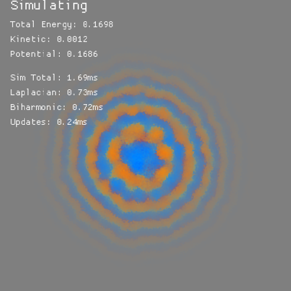

# Phonon Garden

Phonon Garden is a real-time, interactive physics simulation that explores the emergent properties of wave propagation on a discrete 2D space. The project aims to create a visually striking "digital petri dish" where complex wave phenomena like reflection, refraction, and interference arise naturally from a simple set of underlying rules.

## Motivation

Is a continuous space a requirement for a proper simulation or can it be made it into discrete pieces? moreover, does a space require to have "axis" and a concept of direction? When we have a 2D space we often have a coordinate system (x,y) and with that we can very easily identify a direction, and axes.

However, we can also build a space made by a graph of connected nodes, and if the connections don't have any particular order, we wouldn't have the concept of a direction.

What would happen if we built a space like that, discrete, based on nodes and connections, but also the connections were random - and the space would be 2D in the medium and large scales, but technically more like a crumbled knot in the small scale. Would circular patterns emerge naturally?

This is why I built this small demo, just to show myself if it works or not. And it does - kinda.

## It's all AI vibe coding - mostly

Even this file is also AI generated. Some of these sections (like this one) have been written by me. But most of the code is entirely written by different AI agents. Mainly Jules for the scaffolding, GitHub Copilot with Claude 4 for the fine coding, and Gemini 2.5 Pro from AiStudio for guidance and planning.

It's just a toy idea that I wanted to see what happens in these conditions, and I'm sharing just in case anyone finds it interesting in any way. But it's basically for myself, for my own understanding of how physics works if space is discrete, isotropic, and randomly connected.

## Technical Implementation

### 1. The Space: A Random Geometric Graph (RGG)

The discrete space is modeled as a **Random Geometric Graph**. A large number of nodes are placed randomly, and connections are formed based on proximity and a probability function, creating a non-uniform network that allows for the emergence of isotropic behavior.

### 2. The Physics: A Fourth-Order Plate Equation

To achieve a stable and visually smooth wave, the simulation goes beyond a simple wave equation and implements a more physically robust model akin to a stiff plate. The acceleration of each node is determined by a **triad of forces**:

1.  **Tension Force (`α * ∇²u`):** The standard **Graph Laplacian** term, which drives the primary wave propagation.
2.  **Stiffness Force (`-β * ∇⁴u`):** A **Graph Biharmonic** term (the Laplacian of the Laplacian), which strongly penalizes high-frequency "jaggedness." This is the key to suppressing noise and ensuring local smoothness.
3.  **Global Restoring Force (`-k * u`):** A global "spring" force that pulls every node back towards its equilibrium state (`u=0`), ensuring long-term stability.

### 3. Key Features and Optimizations

-   **High-Performance Sparse Matrix Operations:** The core simulation loop achieves its speed by **pre-computing the Laplacian operator into a sparse matrix (`sprs::CsMat`)**. The physics calculations are then performed using highly optimized sparse matrix-vector multiplications, which is significantly faster than iterating through adjacency lists for a graph of this scale.

-   **Advanced Damping Model:** To maintain stability and visual clarity, two sophisticated damping mechanisms are used:
    -   **Adaptive Damping:** Damping is applied most strongly in areas of high curvature, effectively targeting and eliminating numerical noise where it appears.
    -   **Boundary Damping:** A "sponge" layer around the edges of the simulation space absorbs outgoing waves, preventing chaotic reflections and creating the illusion of an infinite medium.

-   **Smooth Interpolated Rendering:** Instead of rendering discrete nodes as individual pixels, the visualization uses a pre-computed influence map. Each screen pixel's final color is a **weighted average of the states of nearby nodes**, resulting in a beautifully smooth, continuous, and anti-aliased image that hides the underlying discrete nature of the graph.

-   **Interactive "Plucking":** Users can click to introduce a disturbance. The initial energy is applied as a smooth Gaussian pulse in *graph space* (using a Breadth-First Search on node connections), respecting the simulation's core principle of operating without Euclidean coordinates for its dynamics.

